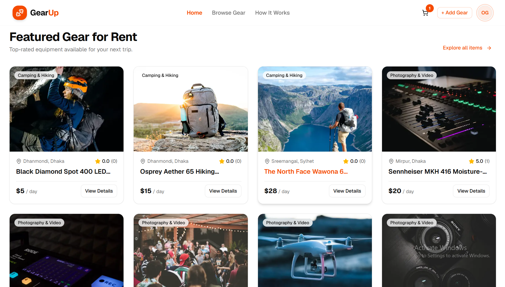
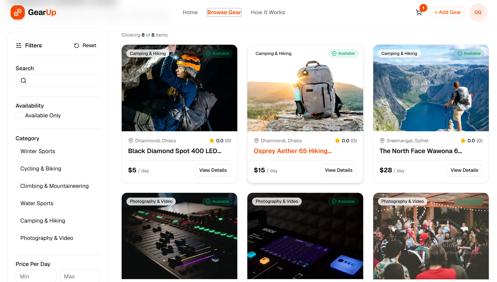
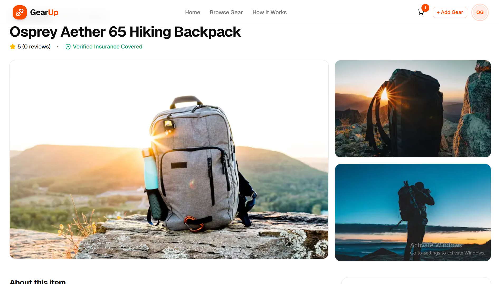
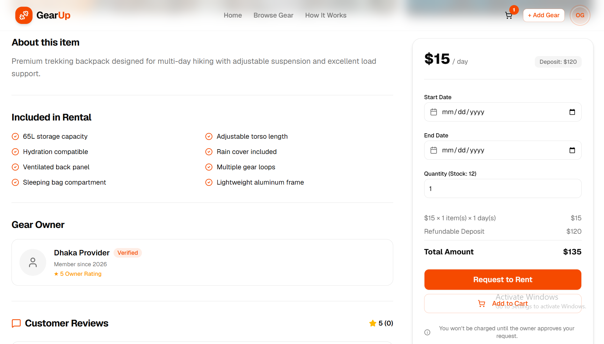
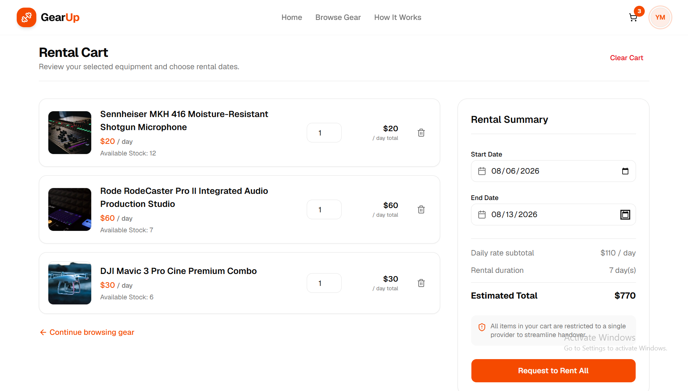
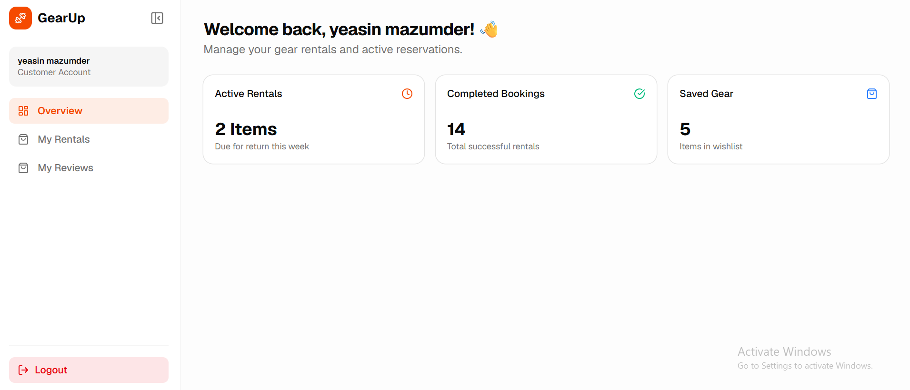
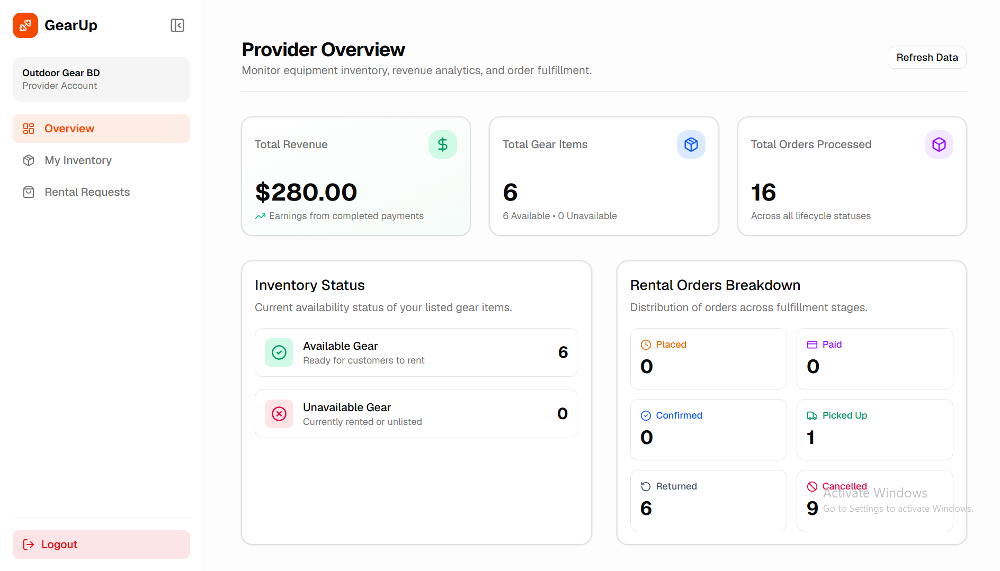
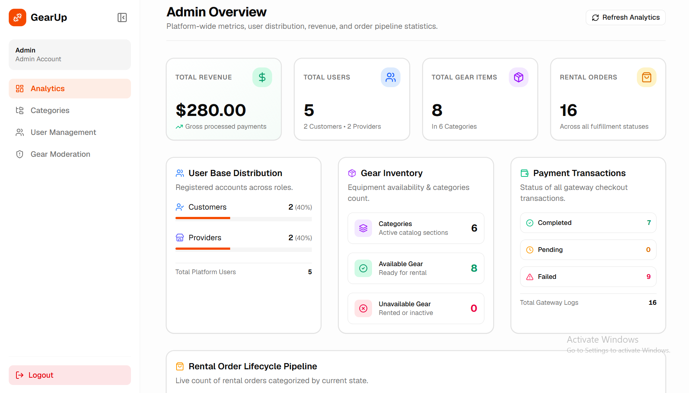

# 🏋️ GearUp Frontend

<p align="center">
  
</p>

<p align="center">
  <strong>Rent Sports & Outdoor Gear Instantly</strong>
</p>

<p align="center">


</p>

---

# 📖 Overview

**GearUp** is a modern, responsive sports and outdoor equipment rental platform built with **Next.js 16**. Customers can browse rental gear, choose rental dates, complete secure payments, and track their orders. Providers manage inventory and rental requests, while administrators oversee the entire platform through dedicated dashboards.

The frontend communicates with a backend REST API and focuses on delivering a fast, intuitive, and responsive user experience.

---

# ✨ Features

## 🌍 Public Features

* Responsive Home Page
* Featured Gear Showcase
* Gear Listing Grid
* Advanced Search
* Category Filtering
* Brand Filtering
* Price Range Filtering
* Availability Date Filtering
* Optimized Images with `next/image`
* Gear Details Page
* Image Gallery
* Provider Information
* Rent Now Section
* Loading Skeletons
* Custom Error Pages
* Responsive Design

---

## 🔐 Authentication

* User Registration
* Email & Password Login
* Role Selection During Registration
* Protected Routes
* Next.js Middleware
* Role-Based Navigation
* Session Management
* Form Validation

---

## 👤 Customer Features

* Browse Available Gear
* Rent Equipment
* Interactive Date Pickers
* Checkout Flow
* Stripe / SSLCommerz Payment Integration
* Payment Success & Cancel Pages
* Order History
* Payment History
* Order Status Tracking
* Review Submission

---

## 🏪 Provider Features

* Provider Dashboard
* Dashboard Statistics
* Add New Gear
* Edit Gear
* Delete Gear
* Inventory Management
* Stock & Availability Control
* Order Management
* Update Rental Status
* Image Upload UI

---

## 👨‍💼 Admin Features

* Admin Dashboard
* Platform Statistics
* User Management
* Suspend / Activate Users
* Gear Moderation
* Rental Monitoring
* Search & Pagination
* Content Management

---

# 🚀 Tech Stack

| Technology       | Description              |
| ---------------- | ------------------------ |
| Framework        | Next.js 16               |
| Language         | TypeScript               |
| Styling          | Tailwind CSS             |
| UI Library       | shadcn/ui                |
| Routing          | App Router               |
| Authentication   | JWT / Better Auth        |
| Forms            | React Hook Form + Zod    |
| HTTP Client      | Axios                    |
| State Management | Zustand                  |
| Notifications    | Sonner / React Hot Toast |

---

# 📂 Project Structure

```bash
.
├── app/
│   ├── (public)/
│   ├── auth/
│   ├── dashboard/
│   │   ├── admin/
│   │   ├── provider/
│   │   └── customer/
│   ├── payment/
│   └── gear/
│
├── components/
├── hooks/
├── lib/
├── services/
├── store/
├── providers/
├── types/
├── utils/
├── public/
└── middleware.ts
```

---

# 🛣️ Application Routes

| Route                 | Description        |
| --------------------- | ------------------ |
| `/`                   | Home Page          |
| `/gear`               | Browse Gear        |
| `/gear/[id]`          | Gear Details       |
| `/auth/register`      | Register           |
| `/auth/login`         | Login              |
| `/dashboard/customer` | Customer Dashboard |
| `/dashboard/provider` | Provider Dashboard |
| `/dashboard/admin`    | Admin Dashboard    |
| `/payment/success`    | Payment Success    |
| `/payment/cancel`     | Payment Cancel     |

---

# 🔄 Customer Journey

```text
Register/Login
      │
      ▼
Browse Gear
      │
      ▼
View Gear Details
      │
      ▼
Select Rental Dates
      │
      ▼
Checkout
      │
      ▼
Stripe / SSLCommerz
      │
      ▼
Payment Success
      │
      ▼
Track Order
      │
      ▼
Leave Review
```

---

# 🏪 Provider Journey

```text
Login
   │
   ▼
Dashboard
   │
   ▼
Manage Inventory
   │
   ▼
Receive Orders
   │
   ▼
Confirm Rental
   │
   ▼
Mark Picked Up
   │
   ▼
Mark Returned
```

---

# 📊 Rental Status

| Status    | Badge     |
| --------- | --------- |
| PLACED    | 🟡 Yellow |
| CONFIRMED | 🔵 Blue   |
| PAID      | 🟣 Purple |
| PICKED_UP | 🟢 Green  |
| RETURNED  | ⚪ Gray    |
| CANCELLED | 🔴 Red    |

---

# 🚀 Getting Started

## Clone Repository

```bash
git clone https://github.com/yeasin-riyad/GearUp-Frontend.git

cd gearup-frontend
```

---

## Install Dependencies

```bash
npm install
```

---

## Configure Environment Variables

Create a `.env.local` file.

```env
NEXT_PUBLIC_API_URL=http://localhost:5000/api

NEXT_PUBLIC_STRIPE_PUBLIC_KEY=

NEXT_PUBLIC_SSLCOMMERZ_STORE_ID=
```

---

## Start Development Server

```bash
npm run dev
```

Open:

```text
http://localhost:3000
```

---

# 📦 Scripts

```bash
npm run dev

npm run build

npm run start

npm run lint
```

---

# 📸 Screenshots

### 🏠 Home Page



---

### 🏋️ Gear Listing



---

### 📄 Gear Details





---

### 🛒 Checkout



---

### 👤 Customer Dashboard



---

### 🏪 Provider Dashboard



---

### 👨‍💼 Admin Dashboard



---

# 🎯 Learning Objectives

* Next.js 16 App Router
* Role-Based Authentication
* Protected Routes
* REST API Integration
* Dynamic Routing
* Server Components
* Client Components
* Middleware
* Responsive UI Design
* Modern Dashboard Architecture
* Form Validation
* State Management
* Payment Integration
* Production Folder Structure

---

# 🚀 Future Improvements

* Wishlist
* Coupon System
* Notifications
* Chat Between Customer & Provider
* Google Authentication
* Image Upload with Cloudinary
* Multi-language Support
* Dark Mode
* Analytics Dashboard
* Email Notifications
* Push Notifications
* PWA Support

---

# 🤝 Contributing

Contributions are welcome!

Feel free to fork the repository, submit pull requests, or open issues.

---

# 📄 License

This project is licensed under the **MIT License**.

---

# ⭐ Support

If you found this project helpful, consider giving it a ⭐ on GitHub!

---

<p align="center">
Built with ❤️ using Next.js 16, TypeScript, Tailwind CSS, shadcn/ui, and modern frontend best practices.
</p>
